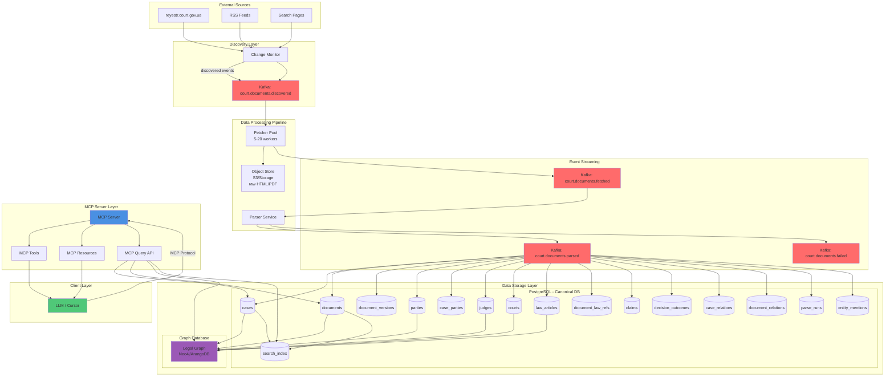
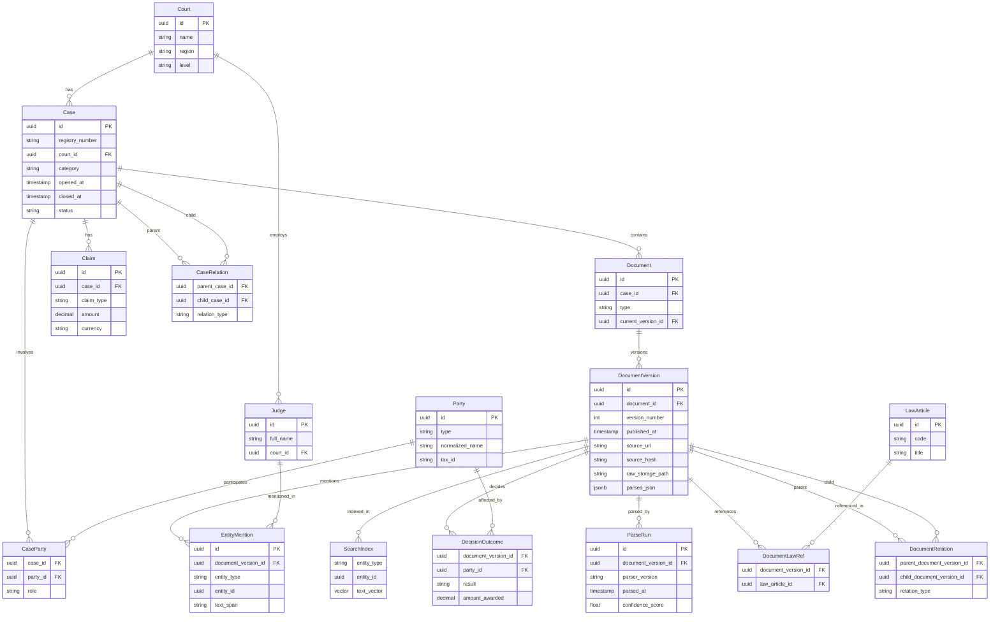
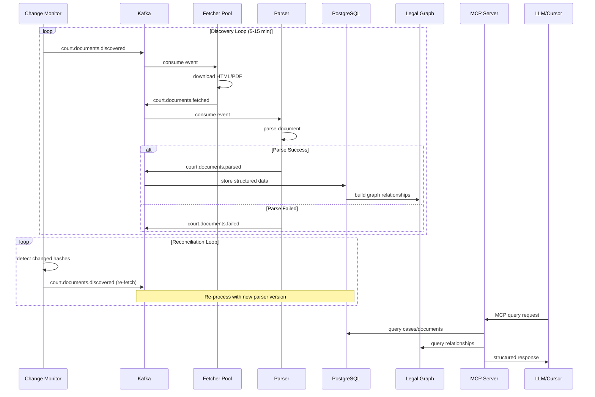
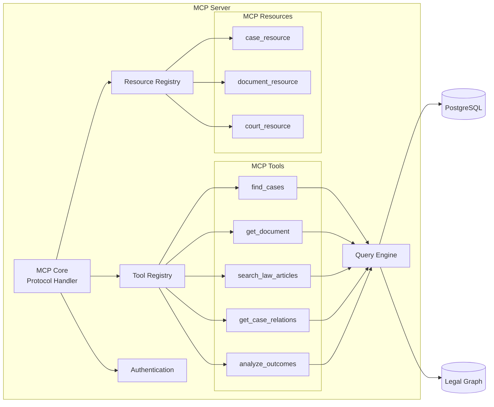

# MCP Architecture Diagram

## Component Architecture

```mermaid
graph TB
    subgraph "External Sources"
        REYESTR[reyestr.court.gov.ua]
        RSS[RSS Feeds]
        SEARCH[Search Pages]
    end

    subgraph "Discovery Layer"
        CM[Change Monitor]
        CM -->|discovered events| KAFKA_DISC[Kafka: court.documents.discovered]
    end

    subgraph "Event Streaming"
        KAFKA_DISC
        KAFKA_FETCH[Kafka: court.documents.fetched]
        KAFKA_PARSE[Kafka: court.documents.parsed]
        KAFKA_FAIL[Kafka: court.documents.failed]
    end

    subgraph "Data Processing Pipeline"
        FP[Fetcher Pool<br/>5-20 workers]
        PS[Parser Service]
        STORAGE[Object Store<br/>S3/Storage<br/>raw HTML/PDF]
    end

    subgraph "Data Storage Layer"
        subgraph "PostgreSQL - Canonical DB"
            CASE_TBL[(cases)]
            DOC_TBL[(documents)]
            DOCVER_TBL[(document_versions)]
            PARTY_TBL[(parties)]
            CASEPARTY_TBL[(case_parties)]
            JUDGE_TBL[(judges)]
            COURT_TBL[(courts)]
            LAW_TBL[(law_articles)]
            DOCLAW_TBL[(document_law_refs)]
            CLAIM_TBL[(claims)]
            OUTCOME_TBL[(decision_outcomes)]
            CASEREL_TBL[(case_relations)]
            DOCREL_TBL[(document_relations)]
            PARSERUN_TBL[(parse_runs)]
            ENTITY_TBL[(entity_mentions)]
            SEARCHIDX_TBL[(search_index)]
        end
        
        subgraph "Graph Database"
            LEGAL_GRAPH[Legal Graph<br/>Neo4j/ArangoDB]
        end
    end

    subgraph "MCP Server Layer"
        MCP_SERVER[MCP Server]
        MCP_TOOLS[MCP Tools]
        MCP_RESOURCES[MCP Resources]
        MCP_API[MCP Query API]
    end

    subgraph "Client Layer"
        LLM[LLM / Cursor]
    end

    %% Data Flow
    REYESTR --> CM
    RSS --> CM
    SEARCH --> CM
    
    CM --> KAFKA_DISC
    KAFKA_DISC --> FP
    FP --> STORAGE
    FP --> KAFKA_FETCH
    KAFKA_FETCH --> PS
    PS --> KAFKA_PARSE
    PS --> KAFKA_FAIL
    KAFKA_PARSE --> CASE_TBL
    KAFKA_PARSE --> DOC_TBL
    KAFKA_PARSE --> DOCVER_TBL
    KAFKA_PARSE --> PARTY_TBL
    KAFKA_PARSE --> CASEPARTY_TBL
    KAFKA_PARSE --> JUDGE_TBL
    KAFKA_PARSE --> COURT_TBL
    KAFKA_PARSE --> LAW_TBL
    KAFKA_PARSE --> DOCLAW_TBL
    KAFKA_PARSE --> CLAIM_TBL
    KAFKA_PARSE --> OUTCOME_TBL
    KAFKA_PARSE --> CASEREL_TBL
    KAFKA_PARSE --> DOCREL_TBL
    KAFKA_PARSE --> PARSERUN_TBL
    KAFKA_PARSE --> ENTITY_TBL
    
    CASE_TBL --> LEGAL_GRAPH
    DOC_TBL --> LEGAL_GRAPH
    PARTY_TBL --> LEGAL_GRAPH
    JUDGE_TBL --> LEGAL_GRAPH
    COURT_TBL --> LEGAL_GRAPH
    LAW_TBL --> LEGAL_GRAPH
    
    CASE_TBL --> SEARCHIDX_TBL
    DOC_TBL --> SEARCHIDX_TBL
    
    MCP_SERVER --> MCP_TOOLS
    MCP_SERVER --> MCP_RESOURCES
    MCP_SERVER --> MCP_API
    
    MCP_API --> CASE_TBL
    MCP_API --> DOC_TBL
    MCP_API --> LEGAL_GRAPH
    MCP_API --> SEARCHIDX_TBL
    
    LLM -->|MCP Protocol| MCP_SERVER
    MCP_TOOLS --> LLM
    MCP_RESOURCES --> LLM

    style MCP_SERVER fill:#4a90e2
    style LLM fill:#50c878
    style KAFKA_DISC fill:#ff6b6b
    style KAFKA_FETCH fill:#ff6b6b
    style KAFKA_PARSE fill:#ff6b6b
    style KAFKA_FAIL fill:#ff6b6b
    style LEGAL_GRAPH fill:#9b59b6
```

## Database Schema Relationships

```mermaid
erDiagram
    Court ||--o{ Case : "has"
    Court ||--o{ Judge : "employs"
    Case ||--o{ Document : "contains"
    Case ||--o{ CaseParty : "involves"
    Case ||--o{ Claim : "has"
    Case ||--o{ CaseRelation : "parent"
    Case ||--o{ CaseRelation : "child"
    
    Document ||--o{ DocumentVersion : "versions"
    DocumentVersion ||--o{ DocumentLawRef : "references"
    DocumentVersion ||--o{ DecisionOutcome : "decides"
    DocumentVersion ||--o{ DocumentRelation : "parent"
    DocumentVersion ||--o{ DocumentRelation : "child"
    DocumentVersion ||--o{ ParseRun : "parsed_by"
    DocumentVersion ||--o{ EntityMention : "mentions"
    
    Party ||--o{ CaseParty : "participates"
    Party ||--o{ DecisionOutcome : "affected_by"
    
    LawArticle ||--o{ DocumentLawRef : "referenced_in"
    
    Judge ||--o{ EntityMention : "mentioned_in"
    
    DocumentVersion ||--o{ SearchIndex : "indexed_in"
    
    Case {
        uuid id PK
        string registry_number
        uuid court_id FK
        string category
        timestamp opened_at
        timestamp closed_at
        string status
    }
    
    Court {
        uuid id PK
        string name
        string region
        string level
    }
    
    Judge {
        uuid id PK
        string full_name
        uuid court_id FK
    }
    
    Document {
        uuid id PK
        uuid case_id FK
        string type
        uuid current_version_id FK
    }
    
    DocumentVersion {
        uuid id PK
        uuid document_id FK
        int version_number
        timestamp published_at
        string source_url
        string source_hash
        string raw_storage_path
        jsonb parsed_json
    }
    
    Party {
        uuid id PK
        string type
        string normalized_name
        string tax_id
    }
    
    CaseParty {
        uuid case_id FK
        uuid party_id FK
        string role
    }
    
    LawArticle {
        uuid id PK
        string code
        string title
    }
    
    DocumentLawRef {
        uuid document_version_id FK
        uuid law_article_id FK
    }
    
    Claim {
        uuid id PK
        uuid case_id FK
        string claim_type
        decimal amount
        string currency
    }
    
    DecisionOutcome {
        uuid document_version_id FK
        uuid party_id FK
        string result
        decimal amount_awarded
    }
    
    CaseRelation {
        uuid parent_case_id FK
        uuid child_case_id FK
        string relation_type
    }
    
    DocumentRelation {
        uuid parent_document_version_id FK
        uuid child_document_version_id FK
        string relation_type
    }
    
    ParseRun {
        uuid id PK
        uuid document_version_id FK
        string parser_version
        timestamp parsed_at
        float confidence_score
    }
    
    EntityMention {
        uuid id PK
        uuid document_version_id FK
        string entity_type
        uuid entity_id
        string text_span
    }
    
    SearchIndex {
        string entity_type
        uuid entity_id
        vector text_vector
    }
```

## Processing Flow

```mermaid
sequenceDiagram
    participant CM as Change Monitor
    participant K as Kafka
    participant FP as Fetcher Pool
    participant PS as Parser
    participant DB as PostgreSQL
    participant G as Legal Graph
    participant MCP as MCP Server
    participant LLM as LLM/Cursor

    loop Discovery Loop (5-15 min)
        CM->>K: court.documents.discovered
        K->>FP: consume event
        FP->>FP: download HTML/PDF
        FP->>K: court.documents.fetched
        K->>PS: consume event
        PS->>PS: parse document
        alt Parse Success
            PS->>K: court.documents.parsed
            K->>DB: store structured data
            DB->>G: build graph relationships
        else Parse Failed
            PS->>K: court.documents.failed
        end
    end
    
    loop Reconciliation Loop
        CM->>CM: detect changed hashes
        CM->>K: court.documents.discovered (re-fetch)
        Note over K,DB: Re-process with new parser version
    end
    
    LLM->>MCP: MCP query request
    MCP->>DB: query cases/documents
    MCP->>G: query relationships
    MCP->>LLM: structured response
```

## MCP Server Components

```mermaid
graph LR
    subgraph "MCP Server"
        MCP_CORE[MCP Core<br/>Protocol Handler]
        TOOL_REGISTRY[Tool Registry]
        RESOURCE_REGISTRY[Resource Registry]
        
        subgraph "MCP Tools"
            FIND_CASES[find_cases]
            GET_DOCUMENT[get_document]
            SEARCH_LAW[search_law_articles]
            GET_RELATIONS[get_case_relations]
            ANALYZE_OUTCOMES[analyze_outcomes]
        end
        
        subgraph "MCP Resources"
            CASE_RESOURCE[case_resource]
            DOC_RESOURCE[document_resource]
            COURT_RESOURCE[court_resource]
        end
        
        QUERY_ENGINE[Query Engine]
        AUTH[Authentication]
    end
    
    MCP_CORE --> TOOL_REGISTRY
    MCP_CORE --> RESOURCE_REGISTRY
    TOOL_REGISTRY --> FIND_CASES
    TOOL_REGISTRY --> GET_DOCUMENT
    TOOL_REGISTRY --> SEARCH_LAW
    TOOL_REGISTRY --> GET_RELATIONS
    TOOL_REGISTRY --> ANALYZE_OUTCOMES
    
    RESOURCE_REGISTRY --> CASE_RESOURCE
    RESOURCE_REGISTRY --> DOC_RESOURCE
    RESOURCE_REGISTRY --> COURT_RESOURCE
    
    FIND_CASES --> QUERY_ENGINE
    GET_DOCUMENT --> QUERY_ENGINE
    SEARCH_LAW --> QUERY_ENGINE
    GET_RELATIONS --> QUERY_ENGINE
    ANALYZE_OUTCOMES --> QUERY_ENGINE
    
    QUERY_ENGINE --> DB[(PostgreSQL)]
    QUERY_ENGINE --> GRAPH[(Legal Graph)]
    
    MCP_CORE --> AUTH
```
